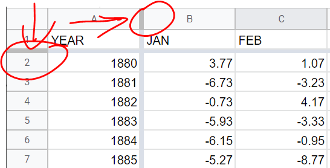

# Analyze your station data
Your task is to analyze and plot your station data, include a trendline, and plot alongside it global average temperature anomalies. After styling your figure to maximize clarity and impact, you will have an opportunity to share your data and plot. 

## 1. Inspect the data
1. Take a few moments to explore the data in the sheet. What do the rows represent? What variables (columns) are in the sheet? Are there missing values in the sheet? 
1. If you have any questions about the data, where it comes from, or what the variables mean, head to the project site and read their [documentation](https://data.giss.nasa.gov/gistemp/station_data_v4_globe/). 
  - You may have noticed that the table contains a few missing monthly average temperatures, represented by values equal to ```999.9```. Extreme values like this are often used to denote missing values, as they are noticeable and will cause a similarly extreme number to any operations using it. 
  - If the  ```metANN``` column is the annual average, how were these calculated for years where months are missing? Read [here](https://data.giss.nasa.gov/gistemp/station_data_v4_globe/seas_ann_means.html) in the documentation to find out. 
1. It would be nice to have the top row (with variable names) and the first comlmn (with years) always visible as you scroll through the data. Freeze the top row (and first column) of the sheet on the screen by pulling down (and over) the horizontal grey bars at the top-left of the sheet until it rests beneath the first row (and to the right of the first column.


## 2. Calculate temperature anomalies
In this step, we are going to calculate annual temperature anomalies using the mean annual temperature values in the ```metANN``` column. We will calculate the anomalies using 1951 - 1980 as the 30-year reference period. 
<br>
From the earlier presentation, recall the process for calculating a temperature anomaly: 
1. Begin with measured values
  - These are in the ```metANN``` column (column R) of the sheet.
2. Identify the reference period 
  - The reference period (i.e. 1951 – 1980) is found in rows 73 - 102 of the sheet.
3. Calculate reference period mean
  - In cell S2, enter the formula ```=average(R73:R102)``` -- this value represents the annual mean during the reference period and will be the value we will subtract from all values in the ```metANN``` column. Give the column a title of ```Reference Mean``` in cell S1. 
4. Subtract reference period mean from measured values (in column T)
  - Give column T a title by entering ```Temp Anomaly (deg C)``` in cell T1
  - In cell T2, enter the formula ```=R2-S$2``` -- **NOTE**: the ```$``` will be critically important in this equation, as it will ensure that all values are subtracting from the reference mean value in cell S2. 
  - To apply the formula to all years, accept the suggestion from Google Sheets to apply down the column (if shown), or drag the blue square on the bottom-right of cell T2 to row 142. This will create temperature anomalies for years 1880 to 2021. 

## 3. Plot your data; add a trend line 
Next, let's make a plot of the your newly-calculated temperature anomaly time series (y-axis) vs time (x-axis), so that we can explore trends at the Detroit Metro Airport over time.
1. Plot the ```Temp Anomaly (deg C)``` column by clicking on the **T** at the top of the column to select all values in it. 
2. Click ```Insert > Chart```, or click the chart icon . A line plot of you calculated annual temperature anomalies will appear.
3. When the chart's ```Setup``` pane appears to the right, make a few modifications:
  - Modify the value in the ```Data range``` box to include all data in the sheet (```A1:Z143```). Don't worry that this stretches beyond the data currently in the sheet--this will save us some time later. 
  - To add Year to the x-axis, cick the ```X-axis``` box and add the ```Year``` variable.
  - Make sure that ```Use row 1 as headers``` and ```Use Column A as lables``` are checked.
4. Add a **trend line** to explore whether there is a trend in the data, click on the blue time series to bring up the ```Customize``` pane. In the pane: 
  - Click the ```Trend line``` check box. 
  - Adjust line opacity, colour, and thickness to help the trend line stand out.  

## 4. Import global temperature anomaly data; plot alongside station data
Now that you have plotted your station temperature anomaly trend, let's compare it with the globally-averaged temperature over the same period. For this, we'll create a new sheet in our current workbook and import [global data](https://data.giss.nasa.gov/gistemp/graphs_v4/) that has also been generated by the NASA Goddard Institute for Space Studies. 
1. Create a new sheet in the current workbook: At the bottom of the Google Sheet, click the "+" symbol. 
2. Import the data using the ```impordata``` function. In cell A1 (top-left), paste the following function: 
```=importdata("https://data.giss.nasa.gov/gistemp/graphs_v4/graph_data/Global_Mean_Estimates_based_on_Land_and_Ocean_Data/graph.csv")```
  - Your new tab now has three columns of data: 
    - ```Year```
    - ```No_Smoothing```, which is global annual mean temperature anomaly (what you'll use in this analysis)
    - ```Lowess(5)```, which is a 5-year averaged value. 
3. Copy rows from the ```No_Smoothing``` column and paste into column U in your original **station** sheet. **NOTE**: Ensure that you paste the data into the proper rows (years) in the sheet. 
  - Give new column of global annual mean temperature anomalies a name (e.g. ```Global Anomaly (deg C)```) in cell U1.
4. To add the global temperature anomaly to your existing figure, double-click on the graph and select to open the ```Setup``` pane. 
  - In the ```Series``` section, click ```Add Series``` and add  ```Global Anomaly (deg C)```. The new time series will appear on the figure (probably in red).
5. Follow steps provided earlier to add a trend line, if you wish. 

## 5. Scrutinize your figure
Not all visualizations are created equal. Just because a chart or map makes sense to you (or has been suggested by sophisticated software) doesn't mean that it will be effective in communicating your message to the intended audience. When creating a visualization, here are a few key considerations to keep in mind:
1. **What is your message?** What information are you trying to communicate to your audience? If you had to summarize the 'point' of the figure in two sentences, what would it be? Keep your message in mind while you design your visualization. 
1. **Who is your intended audience?** For whom are you making this visualization? What do they already understand about the topic or the information that you are presenting? What is the best way to communicate with them?
1. **What is the context?** Where is this visualization being presented? What additional information is being presented alongside it (in the same article, website, etc.)? How much contextualizing information do you need to provide so that the visualization 'stands on its own'?
1. **How will visual elements be interpreted?** The way in which humans interpret visual elements depends on a combination of basic cognitive responses, as well as learned behaviour. As such, it's important to consider that interpretations or responses to visualizations can differ between communities and cultures. For example, think about how the colour red is commonly interpreted: How might the use of red affect the way a visualization is interpreted? 
1. **How can you maximize clarity?** Clarity over content. Your goal when creating a visualization is to convey your message using only the elements that are necessary. This will vary depending on the nature of your *message*, the *intended audience*, the *context*, and the *visual elements* you are using. Approach your visualizations a bit like Marie Kondo: *If an element of your figure does not add to the intended message, simplify it or remove it altogether*. 
<br> 
<br>
Modify the elements of the figure to improve its presentation. This can be done by clicking on the part of the chart and editing in the ```Customize``` pane.
  - Add and/or modify all axis titles. Add the **Year** title to the x-axis by clicking on ```Customize>Chart and axis title>Horizontal axis title``` and adding the label. 
  - Modify text labels 
  - Modify font sizes
  - Edit colours and markers for time series.
  - Add/modify the chart title
  - Add/modify vertical and horizontal grid lines.

## 6. Analyze your results 
1. Compare the time series. How do the trends at your site compare to the global one? Are the mean trends and variability similar? Why or why not? 
2. In what ways is a linear trendline helpful for conveying information? What information about the time series is (or isn't) conveyed by the trend line? 

## 7. Publish your results
If you would like to share your final spreadsheet and figure with others (via a link or by embedding them into a webpage, for example), you can do so by publishing them. 
1. To publish your entire spreadsheet, go to ```File>Share>Publish to web```. Choose whether to generate a link to the data (that you can send to others), or generate embed code (which can be inserted into a web page). 
2. Similarly, you can publish individual figures by clicking on the three dots on the top-right of the graph and selecting ```Publish the chart```.

Congrats, you've completed the exercise! If you would like to explore sources of other open climate data, go to the [Learn More](learn-more) page. 