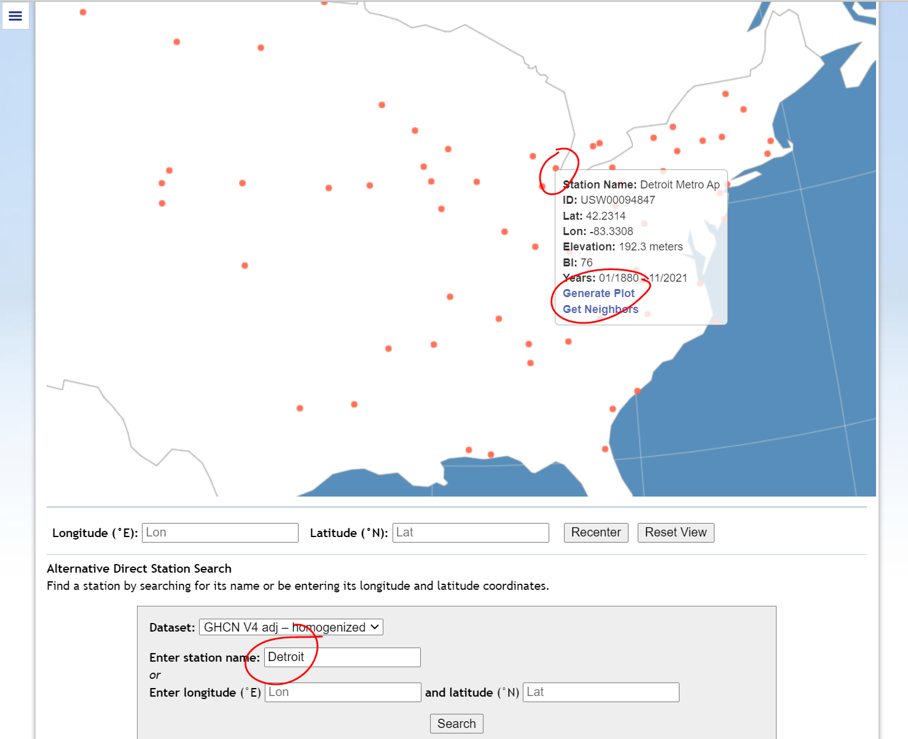

# Preparation
This lesson will be carried out using [Google Sheets](https://sheets.google.com). The data for this lesson will be downloaded from NASA's Goddard Institute for Space Studies' (GISS) Surface Temperature Analysis v4. This includes the [individual station data](https://data.giss.nasa.gov/gistemp/station_data_v4_globe/) and [global averages](https://data.giss.nasa.gov/gistemp/graphs_v4/). 

## Step 1: Open a new Google Sheet
- Go to [Google Sheets](https://sheets.google.com) (log in if required) and open a new sheet.

## Step 2: Get the station data
***NOTE: The rest of this exercise will use station data from Detroit Metro Airport; if you would like to attempt this exercise in a more self-guided manner, feel free to choose another station and follow the steps below.***
- Navigate to the Surface Temperature Analysis [data explorer page](https://data.giss.nasa.gov/gistemp/station_data_v4_globe/). Read the description of the data at the top.
- Use the data explorer globe to find a station with high-quality data that began collecting data before 1880 and continues to do so today.
  - Set **From:** ```January 1880```, **To:** ```November 2021```, and **Dataset:** ```GHCN V4 adj - homogenized``` and click **Update**
  - Explore the stations that are returned. What do you notice about their distribution? How might the global distribution reflect and perpetuate inequalities?
  - To get to the Detroit Metro Airport station page, either: 
    - Zoom into Detroit on the globe (see figure below), hover over the station marker and click **Generate Plot** in the popup window.
	- OR using the **Direct Station Search** box, enter ```Detroit``` and click **Search**. In the results, click ```Detroit Metro Ap```. 
	- Explore the information presented in the [Detroit Metro Airport station page](https://data.giss.nasa.gov/cgi-bin/gistemp/stdata_show_v4.cgi?id=USW00094847&dt=1&ds=14).



<!--

--> 

## Get the data into a new Google Sheet
Three methods of getting this data into a Google Sheet are shown below. If you decide to use the [Shortcut](#Option-3:-Shortcut), please be sure you read through one of the previous methods. 

### Option 1: Download from the station data page
- On the [Detroit Metro Airport station page](https://data.giss.nasa.gov/cgi-bin/gistemp/stdata_show_v4.cgi?id=USW00094847&dt=1&ds=14), under **Downloads**, right-click the word [CSV](https://data.giss.nasa.gov/tmp/gistemp/STATIONS/tmp_USW00094847_14_0_1/station.csv) in  ```download monthly data as text or CSV```, and choose to save the file to your local computer. The file will save as ```station.csv```.
- In your new Google Sheet, click ```Import``` 
- On the **Import file** box, select the **Upload** tab and select the ```station.csv``` file from your computer. Keep all settings at default and click **Import data**.

### Option 2: Download from the station data page
- On the [Detroit Metro Airport station page](https://data.giss.nasa.gov/cgi-bin/gistemp/stdata_show_v4.cgi?id=USW00094847&dt=1&ds=14), under **Downloads**, right-click the word [CSV](https://data.giss.nasa.gov/tmp/gistemp/STATIONS/tmp_USW00094847_14_0_1/station.csv) in  ```download monthly data as text or CSV```, and choose to ```Copy link``` or ```Copy link address```. This will save the URL of the file to your clipboard. 
- In your new Google Sheet, double click on cell A1 (top-left) to edit it and enter the following formula: 
  - ```=IMPORTDATA("https://data.giss.nasa.gov/tmp/gistemp/STATIONS/tmp_USW00094847_14_0_1/station.csv")```, where the URL in quotes is the copied URL from the previous step. Click enter. All data will now appear in your sheet. 
  
### Option 3: Shortcut
- Click on [this link](https://docs.google.com/spreadsheets/d/1b7Z9CwsX1Un8SlL-56WK2H5loEShnOg89nwvXbWhmNo/copy) to create a ready-to-use copy of the data. 

---

When you have completed the preparatory tasks, proceed to the [exercise](exercise) to get started. 
